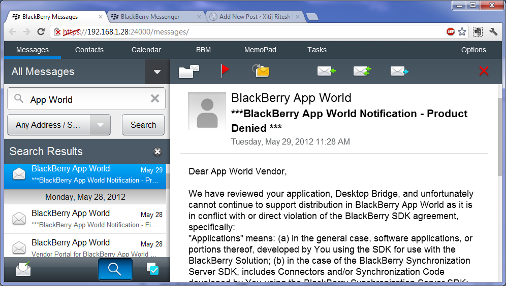

A Desktop Bridge Too Far
########################
:date: 2012-06-12 14:20
:author: Xitij Ritesh Patel
:category: Ventures
:tags: blackberry, desktop bridge, PlayBook, pulsecode

The image above is a screenshot of the e-mail I received at 11:30am on
Tuesday, May 29, 2012, approximately 1.5 hours after I had launched
Desktop Bridge. It effectively killed two weeks of effort to launch a
product from start to finish. I lost the opportunity to measure the
results of launching my minimum viable product (MVP). This blog post
will detail Research in Motion’s (RIM) communications breakdown, and the
failings of the approval process for App World. I will also outline why
RIM needs to differentiate if they want to be competitive, and some
steps they can take towards this goal.

If you don't know what Desktop Bridge is, the following YouTube video
should help illustrate what it does.

.. youtube:: WZGaRTOsmn8
   :align: center

If you'd like to read about the sequence of events leading to Desktop
Bridge's removal, and the launch results, you can read this post:

`Results of Launching Desktop Bridge`_

RIM's Communications Breakdown
------------------------------

While some of what happened with Desktop Bridge is my fault, much of the
blame does lie with RIM as well. This was a consistent and clear failure
of their process, and ultimately a failure of the overall app store
model. To provide some context, I should note that Desktop Bridge was
approved by App World twice. After the first approval, it was pulled
back for further review, and subsequently approved again. The product
was pulled by RIM 1.5 hours after launch.

What happened during the App World approval process? Why did it happen
twice? Why was the only information I received a simple statement about
its 'Pending Review' status? If RIM had concerns, why did they wait
until after I had launched Desktop Bridge to express them? In fact, I
still don't really know what the issue was. Why didn't they deny the app
before? They had two weeks to do so, and I was extremely clear about
what Desktop Bridge did. If someone had actually read the description,
or ran it, they would easily have seen it.

When Desktop Bridge went back for further review after the initial
approval, I had assumed the team responsible for App World approvals was
reviewing the app for security concerns. I now realize that this was a
completely separate process, with no internal communications, and RIM’s
left hand didn’t know what the right hand was doing.

If you read the product denial e-mail, you’ll see that RIM quotes the
part of their SDK agreement stating that the SDK should not be used to
replicate the e-mail functionality or features of the BlackBerry
Solution. One can argue that Desktop Bridge does not modify the e-mail
functionality at all, and simply allows access via another source. RIM
may simply be using this clause to deny Desktop Bridge, but in my
opinion, the reason it was removed was because it allowed unfettered
access to PIM data. They were concerned with the security of the
BlackBerry smartphone. And despite my work to address it, it seemingly
wasn’t enough. Rather than communicate those concerns with me and work
to resolve them, the knee-jerk reaction was to order its removal, after
having approved it twice. Moreover, is that clause in the SDK agreement
a catch-all that can be applied at will? What does it mean for other
apps that provide e-mail access? Are they in violation too? Would RIM
deny apps that replicate other functionality?

In fairness, it is unlikely that RIM would deny apps indiscriminately,
it’s not in their best interests to do so. (Though it is possible, and
the precedent has been set by RIM, and others.) I’m not trying to
advocate for Desktop Bridge’s readmittance into App World. It’s RIM’s
playground, and I need to play by their rules. I’m trying to advocate
for a better user and developer experience. Part of that is ensuring
better communication, and ensuring these types of situations don’t occur
again. Part of that is dealing with greater security concerns.

Misdirected Security Concerns
-----------------------------

It seems to me that RIM’s concern with Desktop Bridge was over security.
While I share some of those concerns, any potential access to PIM data
would have required physical access to either device. And if a malicious
party had physical access, no security measures could really protect
that PIM data, and there are much better ways to access the information
than through Desktop Bridge (e.g. backups). If you ask me, there are
much larger security holes that RIM should be worried about than what
Desktop Bridge may expose. Why aren’t they showing the same concern over
App World’s security?

What do I mean by App World security issues? When I first submitted
Desktop Bridge on May 16, while it was awaiting review, I learned that
others had downloaded copies of it and were decompiling it. This wasn’t
an app posted for sale, it was an app that hadn’t even been seen by the
review team. Moreover, Desktop Bridge was `posted on a piracy website`_
almost 8.5 hours before I launched it. Sure, RIM may have closed the
backup loophole in the most recent OS versions, but there is a gaping
security hole on App World that is a much larger issue. It’s been kept
quiet within the developer community, but it seems that more and more
people are figuring it out. Oh, and RIM has known about it for well over
a year; the JIRA bug is marked confidential. Obscurity is not security,
and RIM has much bigger security fish to fry.

Problems Not Limited To RIM
---------------------------

This communications and delayed product denial issue isn't limited to
RIM; Apple and Google also have similar issues with their app approval
process. As far as I can tell, Google doesn't really have an `approval
process per se`_. Apps are only rejected or removed if they violate the
`Developer Distribution Agreement`_, which seems relatively
straightforward to follow (e.g. violation of trademarks/copyrights,
inclusion of illegal material, etc.). Apple's own iTunes App Store
approval process is just as opaque as RIM's, since developers have no
idea what is being checked for approval. There have been a number of
examples where Apple have approved apps that have their own quality
issues, or violate their agreements. Sometimes they slip through, and
sometimes, they find and remove them.

One recent example of this is Rogue Amoeba's Airfoil Speakers Touch. You
can read about their issues with being removed from the iTunes Store on
their blog.

`Apple Has Removed Airfoil Speakers Touch From The iOS App Store`_

Another prominent example is the recent removal and denial of apps
submitted to the iTunes Store that used the Dropbox SDK. You can read
about that saga at the forum post linked below.

`Apple rejecting applications which use Dropbox. The horror.`_

In Dropbox's case, they ultimately had to cave and remove links to their
user signup page from the SDK. This means that if a user downloads an
app using the Dropbox SDK from the iTunes App Store, and does not have a
Dropbox account, there is no indication within the app on how to create
one. It's a serious blow to the overall user experience and is
ultimately tantamount to Apple squeezing out competitors so they can
sell their own iCloud service. They have done the same with Amazon,
Audible, and others with respect to music, movies, and eBooks that are
sold outside of the iTunes Store.

These problems highlight some of the issues with the app store model.
It's something that developers on other platforms have struggled to cope
with. Your app is only allowed on the storefront if it doesn't violate
some predefined catch-all agreements that can be applied as the store
owner sees fit. If your app competes with their own offerings, they can
and will do everything they can to squeeze you out. It's their sandbox,
and you have to play by their rules. They can take their ball and go
home, leaving you with nothing. It's not like you can play elsewhere,
because when you sign up for their SDK, you agree to sell your software
exclusively through their store and nowhere else.

So RIM is not the only guilty party here with respect to app rejection
and denials. That doesn't make it right. Is RIM trying to compete with
Google and Apple by imitating what they do? Is that the plan to achieve
greater market share and profitability?

Why RIM Hasn't Shown They Can Compete
-------------------------------------

If RIM wants to succeed with BlackBerry 10, they need to entice
developers to the platform with a compelling offering. When you sell
your app on their store, you need to give up 30% of all of your revenue
earned through that app, standard for most platforms. If I am going to
develop for the platform, there has to be compelling reasons to do so.
Usually this means easy and unified market access, translating into
increased sales. The app store model has provided a better overall
experience for users and developers alike. RIM is working hard on
creating a compelling offering with BlackBerry 10, which is why many of
us (myself included) have committed to it. However, with the new
non-compete clauses in the vendor agreement, they’re asking us to sell
on App World exclusively. If they want us to do that, they need to
differentiate from the competitors and be better. Simply replicating
what Apple and Google have done will not result in success. Those
companies established themselves when there were no other competitors.
RIM is entering a market owned by Apple and Google, and needs to play in
a very different environment. Imitation will not work.

One of RIM's potential solutions to differentiate is the app
certification process that we heard about at BlackBerry 10 Jam. We have
not heard any additional details about it so it is difficult to
evaluate. However, we do know that RIM has historically given preference
to strategic partners, with early access to tools, SDKs, and presumably,
support. We can look at `Gameloft's 9mm HD`_ to see how effective this
preferential treatment is. It was released with much fanfare and
promotion from RIM, despite two very glaring issues. If you look at `its
reviews`_, you'll see that many people complained of the inability to
save the game, and some graphics glitches that sometimes resulted in the
game crashing. One would think that with early access to the alpha
version of the native SDK, and support from RIM, Gameloft should have
known that you cannot write files to the app sandbox outside of debug
mode, like the game saving feature does. Or that early revisions of the
OMAP 4430 that the PlayBook uses has errata associated with NEON code,
resulting in incorrect execution. Yet 9mm HD uses NEON instructions,
which is why some users complain of glitches. Surely RIM would have
shared this information, and the necessary workarounds for it with such
a preferred partner.

Certainly, the onus is on Gameloft to adequately test the game, since
not doing so simply hurts themselves. However, if App World testing
couldn’t identify these faults, why would adding a certification process
help? Again, I have not seen the terms for this “quality certification
program,” so I only have past performance as an indicator.

RIM is at odds with itself. They need to increase the number of apps in
App World, but somehow differentiate themselves from their competitors.
They’ve chosen to try to compete on quality, but they haven’t been able
to demonstrate they have a process in place to accomplish that. RIM
needs to build this process now, with scalability in mind. If the App
World team has difficulty with the number of apps being submitted today,
what happens if and when BlackBerry 10 becomes successful?

Action Items
------------

Ultimately, I would like the following questions answered:

#. What occurs during the App World approval process, from start to
   finish? A Dev Blog post with confidential details removed could be a
   good way to publicize this.
#. What steps is RIM taking to ensure something like this doesn't happen
   again?
#. What are RIM's plans for rectifying the real security issues on App
   World?
#. What are RIM’s quality assurance plans for apps outside of the
   certification process, and what will differ for apps that do undergo
   certification? Will developers have input on how this program is
   developed? (It’s been over a month RIM, when will we see this?)

Conclusion
----------

I spent a lot of valuable time developing Desktop Bridge that could have
been directed to other efforts. Had I known early in the process that
the app would be denied, I would have moved onto other ideas. While I
knew there was a chance that exposing PIM data would likely raise some
eyebrows, nothing led me to believe that the app would be denied.
Instead, RIM’s communication breakdown led me to believe the opposite,
that Desktop Bridge would be accepted into App World. Its subsequent
removal means that I will not be able to observe the real success that
Desktop Bridge could have achieved. I sincerely hope that RIM heeds my
advice within this post, and takes my action items seriously. If Desktop
Bridge is doomed to be a lost effort, it is my hope that lessons can be
learned from its failure.

Finally, in a small attempt to recoup some of my costs, I have decided
to make Desktop Bridge available to be sideloaded. If you want it for
free, you should be able to find the link to the pirate site above. If
you'd like to buy it, you can click the button below. I've lowered the
price from $4.99 to $2, but allowed you to name your own price as well.
Please read the notes that I've left on it, as I cannot guarantee future
functionality.

.. raw:: html
   :file: desktop-bridge-gumroad.html

Addendum
--------

Since writing this post, I've had a conference call with RIM's Developer
Relations team. I will be writing another post about the details of that
call.

.. _Results of Launching Desktop Bridge: http://www.xitijpatel.com/2012/06/results-of-launching-desktop-bridge
.. _posted on a piracy website: http://www.ipmart-forum.com/showthread.php?768293-Desktop-Bridge
.. _approval process per se: http://developer.android.com/guide/publishing/publishing.html
.. _Developer Distribution Agreement: http://www.android.com/us/developer-distribution-agreement.html
.. _Apple Has Removed Airfoil Speakers Touch From The iOS App Store: http://rogueamoeba.com/utm/2012/05/24/apple-has-removed-airfoil-speakers-touch-from-the-ios-app-store/
.. _Apple rejecting applications which use Dropbox. The horror.: http://forums.dropbox.com/topic.php?id=59350
.. _Gameloft's 9mm HD: http://appworld.blackberry.com/webstore/content/110781/?lang=en
.. _its reviews: http://appworld.blackberry.com/webstore/content/reviews/110781/?page=3&lang=en#
