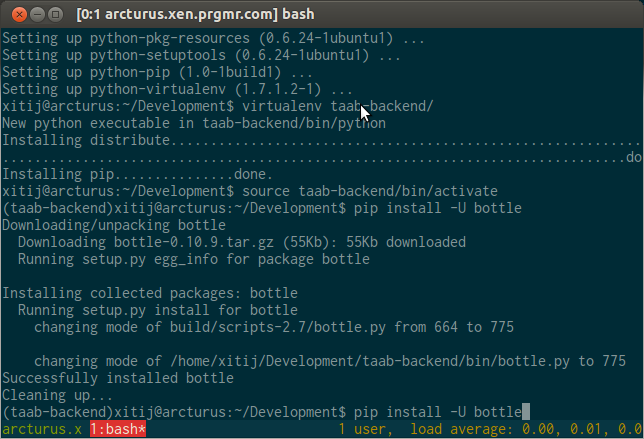

Signing up with prgmr
#####################
:date: 2012-06-13 00:20
:author: Xitij Ritesh Patel
:category: Engineering
:tags: development, prgmr, python, taab, ubuntu, vps

I've used several different VPS providers in the past. My
first experience was with Slicehost, with whom I was happy with until
about 1.5 years ago. I decided that I was fed up with their lack of
competitiveness against other providers.

I switched to Linode, which I use on a daily basis as my main server for
my paid work. This blog is hosted there. I love them, and their support.
If you decide to set up an account with them, here's my referral URL:
`http://www.linode.com/?r=1a8a406431597342d4c3a51b45c2c8eb76fd16c8`_

I also keep an EC2 instance running in the micro tier for some
development work I'm doing there. Today, I wanted to start another
project and wanted to try prgmr out. I've known about them for quite
some time, but the lack of a pretty interface turned me off. However,
upon hearing good reviews from others, I decided to take another look at
them.

Having used EC2, Linode, and Slicehost, I've realized that while pretty
web-based interfaces are nice and helpful at times, I rarely use them.
I'm usually in the terminal, coding or administrating. The price of
prgmr, and the no-nonsense attitude appealed to me. So I gave them a
shot.

I ordered a 256MB server for $8/month to set up Ubuntu 12.04 LTS.
Purists may chide me for picking it, but I'm not a sadist, I'd rather
code than deal with arcane configuration issues. Most of the time,
Ubuntu just works.

Once I registered, I waited while my server was provisioned. I quickly
realized that another benefit of Linode et. al. is that provisioning is
automatic and instant, not manual like prgmr. I searched prgmr's site to
see if I could find a way to contact them, when I found the #prgmr IRC
channel. Once I joined, I caught the attention of lsc, and he went ahead
and processed my registration. I paid the invoice via PayPal, provided
my SSH public key, and within 15 minutes, I was logged into my VPS,
downloading updates and setting up my environment.

I'll have to keep working with it to see if I actually like it, but so
far, the experience has been great. If you need some hand holding, go
with Linode. If you know what you're doing and just need something
cheap, I can wholeheartedly recommend prgmr.

.. _|image1|: http://www.xitijpatel.com/wp-content/uploads/2012/06/arcturus-terminal.png
.. _`http://www.linode.com/?r=1a8a406431597342d4c3a51b45c2c8eb76fd16c8`: http://www.linode.com/?r=1a8a406431597342d4c3a51b45c2c8eb76fd16c8

.. |image0| image:: http://www.xitijpatel.com/wp-content/uploads/2012/06/arcturus-terminal.png
.. |image1| image:: http://www.xitijpatel.com/wp-content/uploads/2012/06/arcturus-terminal.png
