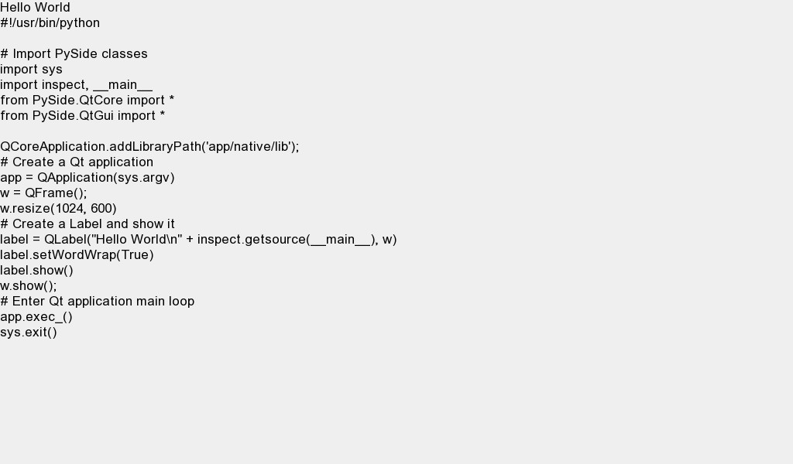

PySide on the BlackBerry PlayBook
#################################
:date: 2012-05-24 14:55
:author: Xitij Ritesh Patel
:category: Engineering
:tags: blackberry, desktop bridge, PlayBook, pulsecode, PySide, python, Qt

Since BlackBerry 10 Jam, I've been spending a lot of time doing
development on the BlackBerry platform. Most of it has been related to
my efforts at `taab`_, but this past week, I decided to tackle something
new on the BlackBerry PlayBook.

If you've been keeping up with my tweets, you'll know that I've been
working on `Desktop Bridge`_ for the BlackBerry PlayBook. While it
awaits approval for App World, I've been working hard at trying to make
improvements to it. One task was the GUI, since it is pretty sparse in
its current form. Moreover, I was hoping to leverage these efforts for
the work I'm doing for taab. Ultimately, I'm hoping to get some sales of
this app, and a prettier GUI would help.

To that end, `Peter Hansen`_ and I got to work on porting
PySide for the BlackBerry PlayBook. He's `detailed our efforts`_ and
it's a worthwhile read. Over the next few days, he and I will make
efforts to submit our changes back to the PySide gitorious repository.
Over the summer, we will do our best to start implementing PySide
support for BlackBerry 10 Cascades, which would be tremendously useful
for BlackBerry 10 development.

More immediately, you can look forward to me using this in Desktop
Bridge, to implement a clean and functional GUI. Due to the requirement
of packaging the libraries ourselves, the application will be quite
hefty, especially for being so simple. However, until RIM can provide
support for these libraries on the PlayBook, there is not much we can
do.

Peter asked for feedback and help from the community, and I'm here to
echo that request. Python support on the BlackBerry 10 platform would
significantly reduce the barrier to entry for mobile app development.
The ideas and possibilities are quite endless, and to be frank, allow
for the creation of apps that would be impossible on other platforms. I
only need to point to Desktop Bridge as an example.

If you want to help us out in the effort, all you have to do is blog or
tweet about it. If you have development expertise, come join us on
#BlackBerryDev on Freenode IRC.

.. _taab: http://www.taab.co
.. _Desktop Bridge: http://www.pulsecode.ca/desktopbridge/
.. _Peter Hansen: http://peterhansen.ca/blog/
.. _detailed our efforts: http://peterhansen.ca/blog/pyside-on-the-playbook.html
