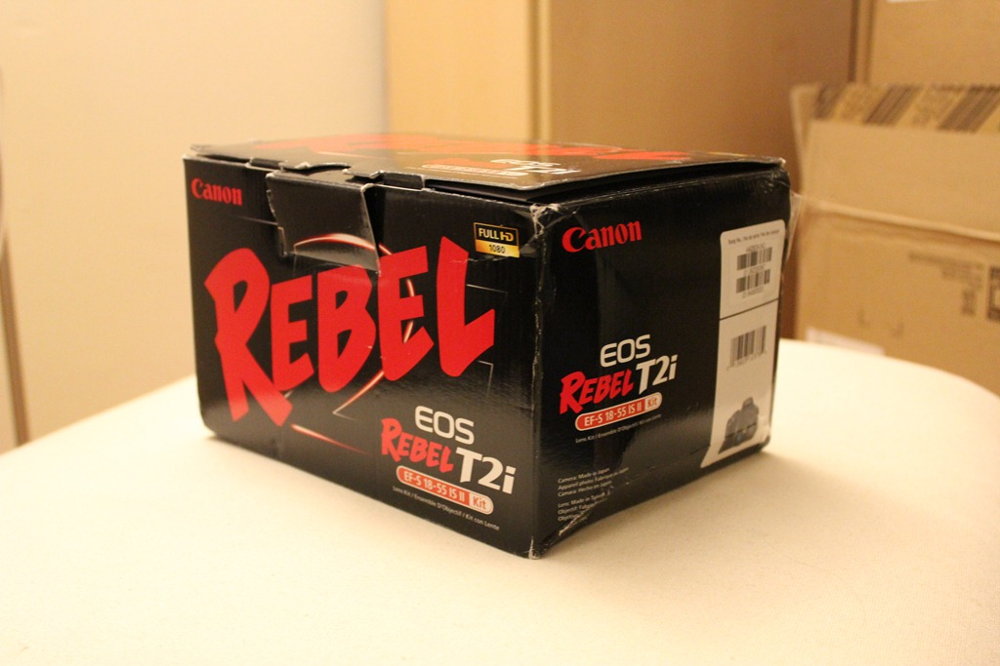
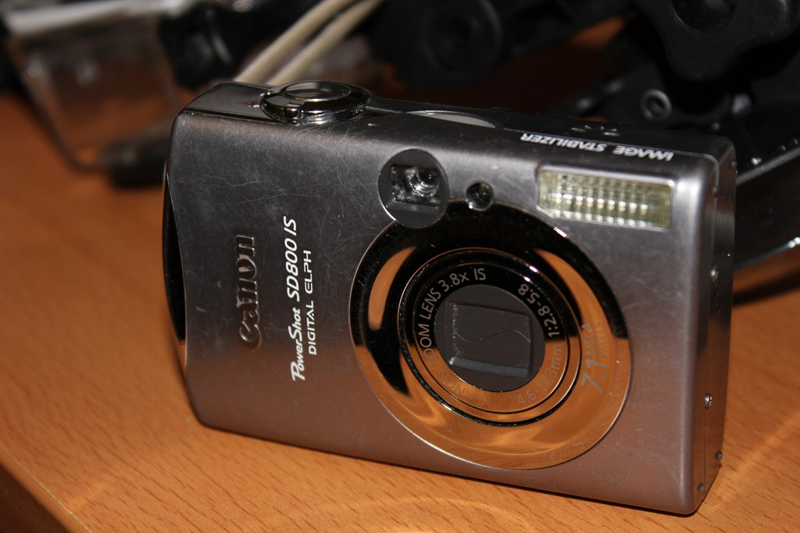
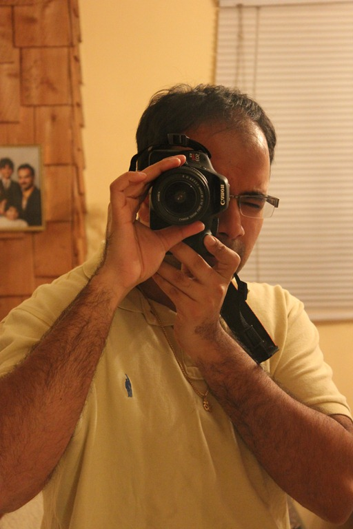
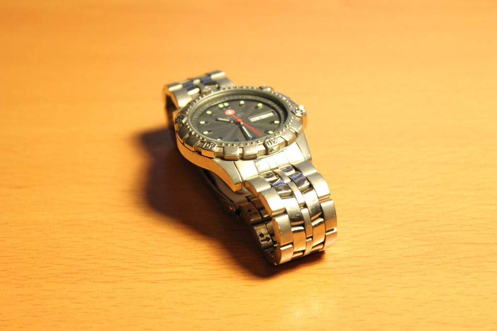

Updates & I picked up a new toy!
################################
:date: 2012-04-24 23:09
:author: Xitij Ritesh Patel
:category: Daily Logs
:tags: blackberry, camera, pulsecode, taab

So I haven’t got too much work done in the last few days, due to having
come down with a bit of a cold. It’s not that bad, but it’s right in my
sinuses, so my eyes and nose are always watery. Makes it difficult to
concentrate.

Nevertheless, I did my best to stay productive. Managed to get my
passport application in, after a huge debacle on my part which ending up
forcing me to visit the office 3 times. I also took care of some items
at Sunnybrook related to my Master’s that I’m continuing to work on.

I managed to finish up a preliminary plan for some contract work that
I’m doing at Pulsecode. I need to get a demo together for that in the
next few weeks, so time is of the essence.

In preparation for my trip to the BlackBerry 10 Jam in Orlando, FL next
week, I’ve been doing work related to my startup, taab. I’ve mapped out
the demo application that I’m going to show off next week, along with
the slide deck. I also managed to get the business cards printed, and
order the NFC tags that I’ll be placing inside them. When those are
finished, I’ll put up a post with more details about that.

But the biggest update is that I picked up a new toy!

I managed to find a brand-new, in box Canon EOS Rebel T2i for $590, with
the full 1 year Canadian warranty and 18-55mm IS lens. I was debating
whether or not to get the lens, but since I don’t own any compatible
lenses, it was a good start. However, I’m already on the hunt for
others!

To be honest, I wasn’t particularly happy about this purchase. It’s
something I’ve wanted for a long time, and I’ve been doing my usual
research, but money is tight right now and it really wasn’t something I
was prepared to purchase. Any and all funds I can devote to my startup
efforts are essential, and I felt that this wasn’t exactly an item I had
in mind.

That said, I bought it precisely because I need it for the startup. If
you’ve been following the taab blog, you’ll notice that I’ve been
putting up pictures and videos with each post. These are taken with
either my BlackBerry Bold 9900, or my BlackBerry PlayBook. While they
have fantastic quality for being a phone/tablet, it wasn’t up to my
standards for the kind of content I want to put up on the site.
Furthermore, I plan on taking a lot more footage in the coming weeks,
with the Jam conference, and with my own product demos. And the
submission for the MintChip Challenge requires a video showcasing the
product. Thus, I came to the conclusion that a decent SLR camera would
be required.

It’s a worthwhile investment, just one that I would rather have made
later.

Here’s some gratuitous test pictures of me playing with the camera.

